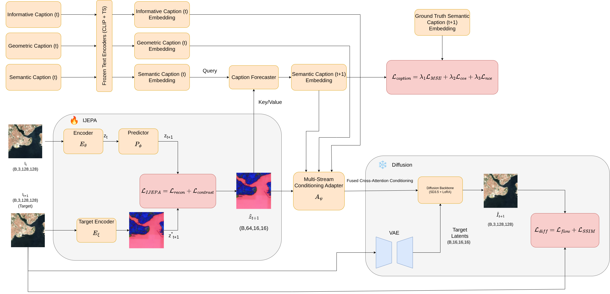

# Sat-JEPA-Diff: Caption-Guided Zero-RGB

**Caption-Guided Zero-RGB Satellite Image Forecasting via Self-Supervised Diffusion**

*Submitted to IEEE Geoscience and Remote Sensing Letters (GRSL)*

[
[](https://openreview.net/forum?id=WBHfQLbgZR)
[](https://huggingface.co/kursatkomurcu/SAT-JEPA-DIFF)
[](https://doi.org/10.5281/zenodo.18868643)
[](https://huggingface.co/datasets/kursatkomurcu/Global-Spatiotemporal-Sentinel-2-Dataset-with-Pre-computed-GEE-Embeddings-2017-2024)
[](LICENSE)

<p align="center">
  
</p>

> **This branch** implements the Caption-Guided Zero-RGB extension. For the original coarse-RGB version (ICLR 2026 ML4RS Workshop), see the [`main`](https://github.com/VU-AIML/SAT-JEPA-DIFF/tree/main) branch.

---

## What's New in This Branch

This branch advances the original Sat-JEPA-Diff by **completely eliminating the 32×32 coarse RGB input** that the previous architecture relied on. Instead, all conditioning comes from hierarchical text captions and self-supervised latent embeddings — a paradigm we call **Zero-RGB Temporal Steering**.

| Feature | `main` (ICLR ML4RS) | `caption-guided` (this branch) |
|---|---|---|
| RGB conditioning | 32×32 coarse downsampled input | **None** (Zero-RGB) |
| Text conditioning | None | Triple-caption system (informative + geometric + semantic) |
| Caption forecasting | N/A | Cross-attention forecaster predicts semantic caption at t+1 |
| Adapter architecture | Single-stream (IJEPA + coarse RGB) | **Multi-stream** (IJEPA + 3 caption embeddings) |
| Temporal consistency | Basic | Temporal attention over history embeddings |
| LPIPS ↓ | 0.4449 | **0.3781** (+15% perceptual improvement) |
| GSSIM ↑ | 0.8984 | 0.8974 (maintained) |

---

## Architecture Overview

The Zero-RGB Sat-JEPA-Diff decouples semantic temporal reasoning from spatial rendering through a dual-stream mechanism:

**Stream 1 — Triple-Captioning System.** Three hierarchical captions describe each satellite patch:
- **Informative caption (t):** Dense pixel-level description (land cover, vegetation, structures)
- **Geometric caption (t):** Spatial layout and topology (shapes, road networks, boundaries)
- **Semantic caption (t+1):** Forecasted high-level description of the future state

Captions are generated offline by [EarthDial](https://github.com/akshaydudhane/EarthDial) and encoded via frozen CLIP×2 + T5 text encoders (same as SD3.5).

**Stream 2 — I-JEPA Spatial Anchor.** An adapted I-JEPA encoder predicts future latent embeddings (ẑ_t+1) that dictate *where* changes manifest, preventing semantic drift without relying on coarse pixels.

**Fusion.** A Multi-Stream Conditioning Adapter fuses the four signals (3 caption embeddings + IJEPA tokens) via learned cross-attention and feeds them into a frozen SD3.5 backbone with LoRA fine-tuning.

---

## Key Results

| Model | L1 ↓ | MSE ↓ | PSNR ↑ | SSIM ↑ | GSSIM ↑ | LPIPS ↓ | FID ↓ |
|---|---|---|---|---|---|---|---|
| **Deterministic Baselines** | | | | | | | |
| Default | 0.0131 | 0.0008 | 37.52 | 0.9361 | 0.7858 | 0.0708 | 0.6959 |
| PredRNN | 0.0117 | 0.0005 | 38.38 | 0.9476 | 0.7836 | 0.0726 | 9.9720 |
| SimVP v2 | 0.0131 | 0.0006 | 37.63 | 0.9391 | 0.7719 | 0.0928 | 18.7208 |
| **Generative Models** | | | | | | | |
| SD 3.5 | 0.0175 | 0.0005 | 32.98 | 0.8398 | 0.8711 | 0.4528 | 0.1533 |
| MCVD | 0.0314 | 0.0031 | 31.28 | 0.8637 | 0.7665 | 0.1890 | 0.1956 |
| Sat-JEPA-Diff (coarse RGB) | 0.0158 | 0.0004 | 33.81 | 0.8672 | 0.8984 | 0.4449 | 0.1475 |
| **Sat-JEPA-Diff (Caption Guided)** | 0.0267 | 0.0025 | 28.95 | 0.7806 | **0.8974** | **0.3781** | 0.2642 |

The caption-guided model achieves a 15% improvement in perceptual realism (LPIPS) while maintaining topological integrity (GSSIM), despite using zero optical inputs at inference.

### Caption Forecasting Performance

| Metric | Score |
|---|---|
| BLEU-1 | 0.7122 |
| BLEU-4 | 0.5267 |
| ROUGE-L | 0.7044 |
| CIDEr | 0.6737 |

---

## Installation

```bash
git clone https://github.com/VU-AIML/SAT-JEPA-DIFF.git
cd SAT-JEPA-DIFF
git checkout caption-guided

conda create -n satjepa python=3.12
conda activate satjepa

pip install torch torchvision --index-url https://download.pytorch.org/whl/cu121
pip install diffusers transformers peft accelerate
pip install rasterio matplotlib pyyaml lpips
```

You need a [Hugging Face token](https://huggingface.co/settings/tokens) with access to [Stable Diffusion 3.5 Medium](https://huggingface.co/stabilityai/stable-diffusion-3.5-medium):

```bash
export HF_TOKEN=hf_your_token_here
```

For caption generation, also install [EarthDial](https://github.com/akshaydudhane/EarthDial):

```bash
git clone https://github.com/akshaydudhane/EarthDial.git
cd EarthDial && pip install -e .
```

---

## Dataset

We use Sentinel-2 RGB imagery (10m GSD) paired with Google Earth Engine Foundation Model embeddings across 100 global Regions of Interest (2017–2024).

**Download:** [Zenodo (DOI: 10.5281/zenodo.18868643)](https://doi.org/10.5281/zenodo.18868643)

Expected directory structure:

```
downloads/
├── Region_Name_1/
│   ├── s2_rgb_Region_Name_1_2017_10km.tif
│   ├── s2_rgb_Region_Name_1_2018_10km.tif
│   ├── gee_embeddings_Region_Name_1_2017_10km.tif
│   └── ...
├── Region_Name_2/
│   └── ...
```

---

## Caption Pipeline

The caption-guided branch requires a three-step preparation before training. This can be done once and reused.

### Step 1: Generate Captions with EarthDial

```bash
python src/generate_captions.py \
    --root_dir /path/to/downloads \
    --output_dir /path/to/captions \
    --model_path akshaydudhane/EarthDial_4B_RGB \
    --patch_size 128
```

This generates three hierarchical captions per patch using a hybrid fast/slow strategy (~6s/patch, ~48h for 29K patches). Outputs are saved as `captions.json` and individual per-patch JSON files. The script supports resume — interrupted runs restart from where they left off.

### Step 2: Precompute Caption Embeddings

```bash
python src/precompute_caption_embeddings.py \
    --caption_dir /path/to/captions \
    --hf_token $HF_TOKEN
```

This encodes all captions into T5 hidden states (77×4096) and CLIP pooled embeddings (2048) using the frozen SD3.5 text encoders, saving them as `.pt` files. Running this offline eliminates ~5GB of GPU memory and ~40% of training compute — the text encoders never need to be loaded during training.

Output structure:

```
captions/
├── captions.json
└── caption_embeddings/
    ├── Region_2017_x0000_y0000.pt
    ├── Region_2017_x0000_y0128.pt
    └── ...
```

### Step 3: Train

Once captions and embeddings are ready, training proceeds as before with caption-specific config options.

---

## Training

Configure your paths in `src/config/s2_future_vith16.yaml`:

```yaml
meta:
  # Caption-guided settings
  use_captions: true
  caption_dir: /path/to/captions
  caption_forecast_weight: 0.5
  caption_dropout_prob: 0.1
  caption_forecaster_layers: 3
  caption_forecaster_hidden: 1024

  # Standard settings
  enable_ijepa: true
  use_lora: true
  lora_rank: 16
  lora_alpha: 32
  sd_loss_weight: 1.0
  crop_size: 128
```

Then run:

```bash
python src/main.py --fname src/config/s2_future_vith16.yaml
```

### Training Details

The model jointly optimizes three losses:

**ℒ_total = ℒ_IJEPA + λ_sd · ℒ_diff + λ_cap · ℒ_caption**

| Loss | Components | Purpose |
|---|---|---|
| ℒ_IJEPA | L1 + cosine + contrastive + spatial variance + feature regularization | Latent spatial anchor prediction |
| ℒ_diff | Flow matching MSE + SSIM | Image generation quality |
| ℒ_caption | MSE + cosine + contrastive on caption embeddings | Semantic caption forecasting |

Training takes approximately 5 days on a single NVIDIA RTX 5090 (24GB). The health-check system validates all components before committing to long training runs.

### Key Config Options

| Parameter | Default | Description |
|---|---|---|
| `use_captions` | `true` | Enable caption-guided conditioning |
| `caption_dir` | — | Path to captions and precomputed embeddings |
| `caption_forecast_weight` | `0.5` | Weight for caption forecasting loss |
| `caption_dropout_prob` | `0.1` | Random caption dropout during training |
| `caption_forecaster_layers` | `3` | Cross-attention layers in forecaster |
| `enable_ijepa` | `true` | Train IJEPA module |
| `use_lora` | `true` | LoRA fine-tuning on SD3.5 |
| `lora_rank` | `16` | LoRA rank |
| `sd_loss_weight` | `1.0` | Diffusion loss weight |

---

## Inference

Single-step prediction:

```bash
python src/inference.py \
    --checkpoint path/to/best.pth.tar \
    --input image_t.tif \
    --output prediction_t+1.tif
```

Autoregressive rollout (multi-year forecasting):

```bash
python src/autoregressive_rollout.py \
    --checkpoint path/to/best.pth.tar \
    --steps 30
```

---

## Evaluation

```bash
python src/evaluate.py --checkpoint path/to/best.pth.tar
```

Computes L1, MSE, PSNR, SSIM, GSSIM, LPIPS, and FID metrics. Caption forecasting quality is also evaluated via BLEU, ROUGE-L, and CIDEr.

---

## Project Structure

```
src/
├── config/
│   └── s2_future_vith16.yaml        # Training configuration
├── data/
│   └── data.py                      # Sentinel-2 + GEE embedding dataset
├── masks/
│   └── multiblock.py                # I-JEPA multi-block masking
├── models/
│   └── vision_transformer.py        # ViT encoder & predictor
├── utils/
│   ├── distributed.py               # Multi-GPU utilities
│   ├── logging.py                   # CSV logger & metrics
│   ├── schedulers.py                # LR & weight decay schedules
│   └── tensors.py                   # Tensor operations
│
├── main.py                          # Entry point
├── train.py                         # Joint training (IJEPA + SD + caption)
├── sd_models.py                     # SD3.5 + Multi-Caption Adapter + LoRA
├── sd_joint_loss.py                 # Flow matching loss + diffusion sampling
├── caption_forecaster.py            # Caption forecaster (cross-attn + gated delta)
├── generate_captions.py             # EarthDial caption generation
├── precompute_caption_embeddings.py  # Offline text encoder embedding
├── metrics.py                       # PSNR, SSIM, GSSIM, LPIPS, FID
├── inference.py                     # Single-step prediction
├── evaluate.py                      # Full evaluation pipeline
├── autoregressive_rollout.py        # Multi-year recursive prediction
├── embedding_validation.py          # Embedding consistency checks
└── helper.py                        # Model & optimizer initialization
```

### New in This Branch

| File | Description |
|---|---|
| `caption_forecaster.py` | Cross-attention module that predicts semantic caption embedding at t+1 from IJEPA tokens + semantic embedding at t. Uses gated residual delta prediction. |
| `generate_captions.py` | EarthDial-based triple-caption generator with hybrid fast/slow inference strategy and thermal management. |
| `precompute_caption_embeddings.py` | Offline CLIP+T5 encoding of all captions to `.pt` tensors. Eliminates text encoders from training. |
| `sd_models.py` | Rewritten with `MultiCaptionConditioningAdapter` (4-stream fusion + temporal attention), replacing the single-stream adapter. |
| `sd_joint_loss.py` | Updated for multi-caption conditioning with caption dropout during training. |
| `train.py` | Extended with caption forecaster training, precomputed embedding loading, and caption-aware data collation. |

---

## Citation

```bibtex
@article{komurcu2026satjepadiff_caption,
  title={Sat-{JEPA}-Diff: Caption-Guided Zero-{RGB} Satellite Image Forecasting via Self-Supervised Diffusion},
  author={K{\"o}m{\"u}rc{\"u}, K{\"u}r{\c{s}}at and Petkevicius, Linas},
  journal={IEEE Geoscience and Remote Sensing Letters},
  year={2026},
  note={Submitted}
}

@inproceedings{komurcu2026satjepadiff,
  title={Sat-{JEPA}-Diff: Bridging Self-Supervised Learning and Generative Diffusion for Remote Sensing},
  author={Kursat Komurcu and Linas Petkevicius},
  booktitle={4th ICLR Workshop on Machine Learning for Remote Sensing (Main Track)},
  year={2026},
  url={https://openreview.net/forum?id=WBHfQLbgZR}
}
```

---

## Acknowledgments

This project was funded by the European Union (project No S-MIP-23-45) under the agreement with the Research Council of Lithuania (LMTLT). The authors thank Vilnius University for providing the computational infrastructure.

The I-JEPA implementation is based on [Meta's I-JEPA](https://github.com/facebookresearch/ijepa). The diffusion backbone uses [Stable Diffusion 3.5 Medium](https://huggingface.co/stabilityai/stable-diffusion-3.5-medium) by Stability AI. Captions are generated by [EarthDial](https://github.com/akshaydudhane/EarthDial).
